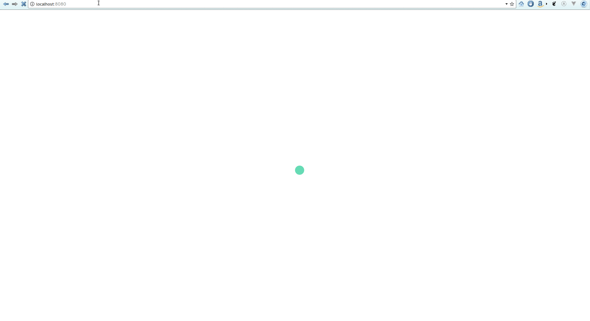

# APOLLO CONNECTOR KIT
Boilerplate for Apollo authentication/authorization



Ecosystem:
- Apollo Server (with Express)
- Apollo Client 2.0
- Vue.js (frontend web client)
- React (frontend web client)


## Installation
Clone this repo using

`git clone https://github.com/ecerroni/apollo-connector-kit.git`

Move to the appropriate directory:

`cd apollo-connector-kit`

From the project's root folder

`yarn install-all`

## Run whole development
from the project's root folder

`yarn start`

## Run a single server
You may also run servers separately

### VUE
from the project's root folder

`cd frontend-vue && yarn dev`

### REACT
from the project's root folder

`cd frontend-react && yarn dev`

### APOLLO
from the project's root folder

`cd backend && yarn start`

## Usage

### USERS
There are 2 mock users:

[Admin role]

username: ric0

password: 123456

--------------

[Limited permissions role]

username: kris

password: 123456

### SETTINGS
All essentials settings are under the `settings` folder.

You may change them as you see fit and they will propagate to the backend as well as across
all client folders.

N.B. Because of how CRA works the frontend react will not pickup changes even after restarting the
server (like Vue does, but for few changes related to the endpoint);

As a workaround you should always stop the server and run from the root project:

`cd frontend-react && yarn install`

Then restart the server

### AUHENTICATION STRATEGIES

#### Server
By default it accepts both LOCAL_STORAGE and HTTP_ONLY requests from clients.

If you want to narrow it down to just on type of authentication request being accepted you will need to set either one of the following to `false` in `./settings/app.json`:

```
  "STRATEGIES": {
    "HTTP_ONLY": true,
    "LOCAL_STORAGE": true
  },
```

If you set them both to `false` the server will stop accepting requests altogether.

#### Client
The client to have its requests accepted by the server it needs to declare what authentication strategy it is willing to use. The choosen strategy should match one of those allowed by the server, otherwise client's requests will be always rejected.

To set which type of authentication requests the client is willing to use set it here:
- For React: `./frontend-react/src/environment/_auth.js`
- For Vue: `./frontend-vue/src/environment/_auth.js`

Choose local storage

`export const CLIENT_AUTH_REQUEST_TYPE = AUTH.STRATEGIES.CLIENT.LOCAL_STORAGE;`

OR 

Choose cookies

`export const CLIENT_AUTH_REQUEST_TYPE = AUTH.STRATEGIES.CLIENT.HTTP_ONLY`

### APOLLO GRAPHQL COMPONENTS
You may create new graphql components just by typing from project's root folder:

`cd backend`

`yarn add-component-part <component_name> <component_part>`

Ex. `yarn add-component-part User user-authentication`

The above will create under `components` a new folder named `User` with a subfolder named
`user-authentication`

`user-authentication` has all files needed to implement your component. You just need to fill them;

- `_input.js`: input types you need for your component part's mutations
- `_mutation.js`: all mutations for this component part go here
- `_query.js`: all queries for this component part go here
- `_type.js`: all types and type resolvers for this component part go here

You may implement only what you need, though you should never delete any of these files. For example
if you have no mutations and no inputs for a component part you should not delete _input.js and
mutations.js. Just leave them there as they were created by the script.

Each component has at least one part, though it can have many.

Ex.
components
```
- components
-- User
--- user-authentication
--- user-data
```

You may want to delete an existing graphql components just by typing from project's root folder:

`cd backend`

`yarn remove-component-part <component_name> <component_part>`

Ex. `yarn remove-component-part User user-authentication`

The above will delete under `components` in the folder named `User` the subfolder named
`user-authentication`

Moreover if the folder named `User` has no more sub-part it will be deleted by the script as well

Otherwise the server/nodemon may not immediately pick up changes in components' structure and even
throw errors (for example adding/deleting components manually),


## Additional:
[Medium post](https://blog.mvp-space.com/authentication-and-authorization-boilerplate-with-apollo-2-0-b77042aba3f6)

## TODO:
- add graphql-tester package and initial tests
- Swap ElementUI with KeenUI (if is it worth)


## Thanks To
- [Ryan Chenkie's GraphQL Summit 2017 talk](https://www.youtube.com/watch?v=4_Bcw7BULC8)
- [Zach Silveira's blog](https://zach.codes/tag/graphql)
- [Ben Awad' Video tutorial](https://www.youtube.com/watch?v=0MKJ7JbVnFc)